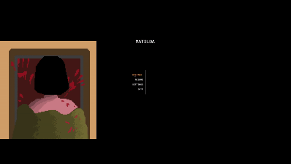

# Matilda
<h1>Juego en desarrollo: Matilda</h1>
<h3>Programado por: Hernán Kleinubing</h3>

<h4>Ventanas de dialogos interacticas de los personajes</h4>

<h4>Menu interactivo con opciones de display</h4>

<h4>Comportamiento de ataque del enemigo</h4>

<h4>Interacción con objetos del ambiente</h4>

